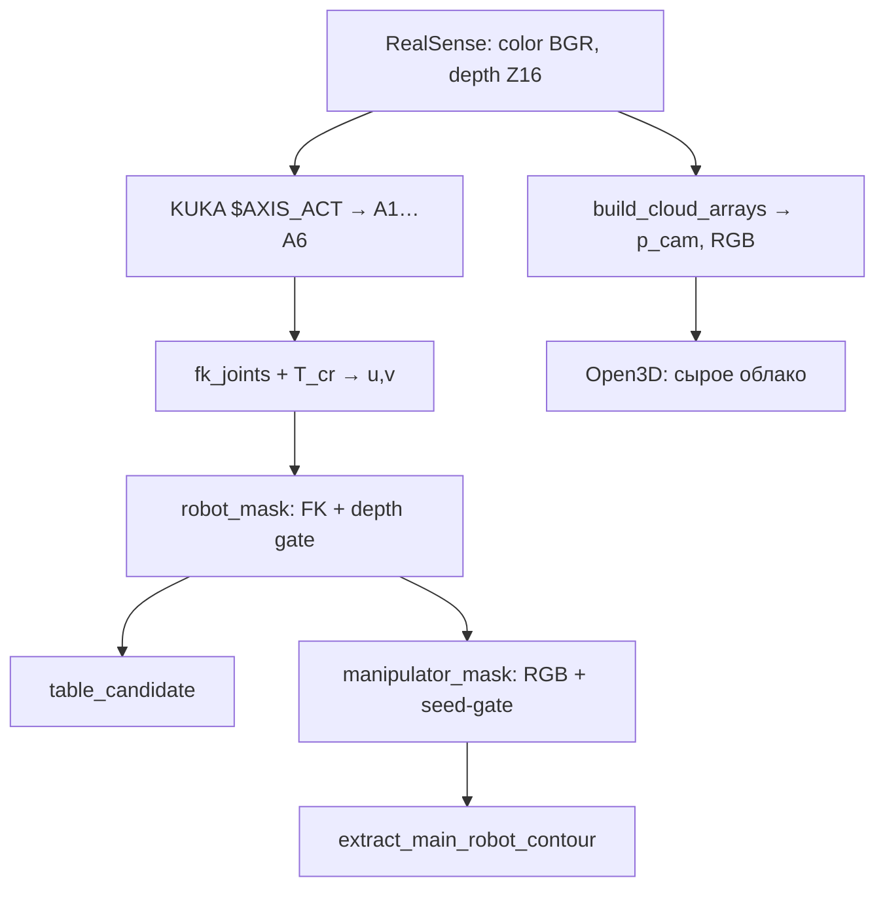

# RealSense + KUKA KR6: облако точек, маски и контур манипулятора

Проект захватывает RGB-D кадры с Intel RealSense, читает углы KUKA (`$AXIS_ACT`), строит **3D-облако** для визуализации и **2D-бинарные маски** для выделения манипулятора, стола и (опционально) хвата/запястья.

> **Важно.** В рабочем цикле `main.py` бинарная маска манипулятора **не** получается порогом по облаку точек. Маски строятся на **карте глубины и RGB**; облако идёт **параллельной веткой** (Open3D). Связь «пиксель ↔ точка» есть через `valid_flat`, но в `main` для масок не используется.

---

## Содержание

1. [Архитектура](#1-архитектура)
2. [Входные данные](#2-входные-данные)
3. [Облако точек (depth → 3D)](#3-облако-точек-depth--3d)
4. [Кинематика и проекция FK](#4-кинематика-и-проекция-fk)
5. [Маска робота `robot_mask`](#5-маска-робота-robot_mask)
6. [Маска стола `table_candidate`](#6-маска-стола-table_candidate)
7. [Маска манипулятора `manipulator_mask`](#7-маска-манипулятора-manipulator_mask)
8. [Контур манипулятора](#8-контур-манипулятора)
9. [Соседи и кластеризация](#9-соседи-и-кластеризация)
10. [Сторонние объекты в кадре](#10-сторонние-объекты-в-кадре)
11. [Модули вне основного цикла](#11-модули-вне-основного-цикла)
12. [Нагрузка на CPU/GPU](#12-нагрузка-на-cpugpu)
13. [Структура проекта](#13-структура-проекта)
14. [Запуск и калибровка](#14-запуск-и-калибровка)

---

## 1. Архитектура



| Ветка | Файлы | Назначение |
|-------|--------|------------|
| 3D | `pointcloud_pipeline.py`, `main.py` | Визуализация, сохранение PLY (`s`) |
| 2D маски | `gripper_detection.py`, `kuka_fk.py` | Seed, стол, тело руки, контур |
| Калибровка | `calibrate_camera_robot.py` | Матрица `T_cr` |

---

## 2. Входные данные

| Обозначение | Описание |
|-------------|----------|
| `I(u,v)` | Цвет BGR, `u ∈ [0,W-1]`, `v ∈ [0,H-1]` |
| `D(u,v)` | Depth в raw-единицах сенсора (uint16) |
| `s_d` | `depth_scale` — метры на единицу raw (≈ 0.001) |
| `K` | Матрица внутренних параметров: `fx, fy, cx, cy` |
| `q = [A1,…,A6]` | Углы суставов, градусы |
| `T_cr ∈ ℝ^{4×4}` | Однородное преобразование **robot → camera** (из `extrinsic.json`) |

Диапазон глубины (по умолчанию): `z_min = 0.15` м, `z_max = 1.8` м.

---

## 3. Облако точек (depth → 3D)

**Файл:** `pointcloud_pipeline.py` → `build_cloud_arrays`.

### 3.1 Глубина и маска валидности

\[
z(u,v) = D(u,v) \cdot s_d
\]

\[
\mathrm{valid}(u,v) = (z_{\min} < z) \land (z < z_{\max}) \land (D > 0)
\]

### 3.2 Пинхольная камера (система камеры, метры)

\[
x = \frac{(u - c_x)\, z}{f_x}, \qquad
y = \frac{(v - c_y)\, z}{f_y}
\]

\[
\mathbf{p}_{\mathrm{cam}} = \begin{bmatrix} x \\ y \\ z \end{bmatrix}
\]

Цвет точки: `RGB = BGR / 255` из того же пикселя.

### 3.3 Связь с плоским индексом

Для каждого кадра строится массив `valid_flat` длины `H·W` (развёртка `valid`). Индекс точки в облаке для пикселя `(u,v)`:

\[
k = \sum_{i=0}^{vW+u} \mathrm{valid\_flat}[i]
\]

(используется в `segmentation.split_cloud_by_mask`, в `main` пока не вызывается).

### 3.4 Опциональная фильтрация облака (не в `main`)

**Voxel downsample** (`filter_cloud`): ячейка размера `voxel_size`, усреднение точек.

**Statistical outlier** (Open3D): для точки \(\mathbf{p}_i\) среднее расстояние до `nb_neighbors` ближайших соседей; отсечение, если

\[
\|\mathbf{p}_i - \bar{\mathbf{p}}_{\mathrm{nn}}\| > \mu + \mathrm{std\_ratio} \cdot \sigma
\]

**RANSAC стола** (`remove_table_plane`): плоскость \(ax+by+cz+d=0\), точки с

\[
\frac{a x + b y + c z + d}{\|\mathbf{n}\|} > h_{\min}
\]

остаются как «объекты над столом».

---

## 4. Кинематика и проекция FK

**Файл:** `kuka_fk.py`.

### 4.1 DH-звено (стандартная конвенция)

Для звена \(i\) с параметрами \((a_i, d_i, \alpha_i, \theta_i)\):

\[
\theta_i = A_i^{\mathrm{(deg)}} + \theta_i^{\mathrm{offset}}
\]

\[
{}^{i-1}\!T_i =
\begin{bmatrix}
\cos\theta_i & -\sin\theta_i\cos\alpha_i & \sin\theta_i\sin\alpha_i & a_i\cos\theta_i \\
\sin\theta_i & \cos\theta_i\cos\alpha_i & -\cos\theta_i\sin\alpha_i & a_i\sin\theta_i \\
0 & \sin\alpha_i & \cos\alpha_i & d_i \\
0 & 0 & 0 & 1
\end{bmatrix}
\]

Накопление от базы:

\[
{}^{0}\!T_i = {}^{0}\!T_1 \cdot {}^{1}\!T_2 \cdots {}^{i-1}\!T_i
\]

Позиция сустава \(i\) в базе робота (метры):

\[
\mathbf{p}_i^{\mathrm{robot}} = {}^{0}\!T_i \begin{bmatrix} 0 \\ 0 \\ 0 \\ 1 \end{bmatrix}_{1:3}
\]

`fk_joints` возвращает 7 точек: база + J1…J6 (фланец).

### 4.2 Robot → camera

\[
\mathbf{p}_{\mathrm{cam}} = T_{cr} \begin{bmatrix} \mathbf{p}^{\mathrm{robot}} \\ 1 \end{bmatrix}, \qquad
X = p_{\mathrm{cam},1},\; Y = p_{\mathrm{cam},2},\; Z = p_{\mathrm{cam},3}
\]

### 4.3 Проекция в пиксель

\[
u = f_x \frac{X}{Z} + c_x, \qquad
v = f_y \frac{Y}{Z} + c_y
\]

Список `fk_uvs[0…6]`: база, J1…J6.  
**J6 (A6)** — центр ROI хвата и линия front-view smart-cut.  
**J5 (A5)** — ROI запястья.

### 4.4 Фронтальный вид

\[
\mathrm{front\_view} = \left| u_{J6} - \frac{W}{2} \right| < 0.22\, W
\]

---

## 5. Маска робота `robot_mask`

**Файл:** `gripper_detection.py` → `build_robot_depth_mask`.

Геометрический **seed** в 2D, не проверка точек облака.

### 5.1 Скелет по FK

Между соседними суставами \((u_i,v_i)\) и \((u_{i+1},v_{i+1})\):

- отрезок толщиной \(2 r_{\mathrm{link}}\);
- круги радиуса \(r_{\mathrm{link}}\) в узлах.

Ожидаемая глубина на пикселе скелета: линейная интерполяция \(z_i, z_{i+1}\) из FK в камере.

### 5.2 Дилатация

\[
M_{\mathrm{geom}} = \mathrm{dilate}(M_{\mathrm{skel}},\, k_{\mathrm{dilate}})
\]

### 5.3 Depth gate

\[
z_m(u,v) = D(u,v)\cdot s_d
\]

\[
M_{\mathrm{robot}}(u,v) = M_{\mathrm{geom}}(u,v) \land \mathrm{valid}(u,v) \land \left| z_m - z_{\mathrm{exp}} \right| < \varepsilon_z
\]

По умолчанию \(\varepsilon_z \approx 0.09\) м (`robot_mask_depth_eps_m`).

---

## 6. Маска стола `table_candidate`

**Файл:** `build_table_mask`.

### 6.1 Оценка глубины стола

Если задано `table_depth_m > 0`:

\[
z_{\mathrm{table}} = \texttt{table\_depth\_m}
\]

Иначе — нижняя полоса кадра (ниже ~62% высоты), вдали от dilate(robot_seed):

\[
z_{\mathrm{table}} = \mathrm{percentile}\big(\{z_m \mid \text{нижняя полоса, вне seed}\},\, p\big),\quad p \in \{55, 70\}
\]

### 6.2 Кандидат по глубине

\[
T_{\mathrm{raw}}(u,v) = \mathrm{valid}(u,v) \land \big(z_m \ge z_{\mathrm{table}} - \Delta_{\mathrm{table}}\big)
\]

Ограничение по строке: только \(v \ge \lfloor H \cdot y_{\min}^{\mathrm{frac}} \rfloor\).

### 6.3 Connected components

Из \(T_{\mathrm{raw}}\) выбирается одна компонента с максимумом ключа \((\mathrm{area},\, w/h)\) при фильтрах минимальной площади, ширины и высоты.

### 6.4 Защита робота

\[
T = T \setminus \mathrm{dilate}(\mathrm{robot\_seed} \cup \mathrm{protect})
\]

---

## 7. Маска манипулятора `manipulator_mask`

**Файл:** `build_manipulator_mask`.

### 7.1 Seed и «ближайшие» пиксели (distance transform)

\[
S = \mathrm{dilate}(M_{\mathrm{robot}},\, r_{\mathrm{seed}})
\]

\[
d(u,v) = \mathrm{distanceTransform}(\neg S) \quad \text{(L2, в пикселях)}
\]

\[
\mathrm{near\_seed}(u,v) = \big(d(u,v) \le d_{\max}\big), \quad d_{\max} \approx 110\ \text{px}
\]

Это **не** k-NN в 3D, а расстояние на 2D-сетке до множества seed.

### 7.2 Адаптивный порог яркости (локальные соседи)

\[
I_g = \mathrm{gray}(I)
\]

\[
\mu = G_{\sigma} * I_g, \qquad
\sigma = \sqrt{\max\big(0,\; G_{\sigma} * I_g^2 - \mu^2\big)}
\]

где \(G_{\sigma}\) — GaussianBlur с окном \(w \times w\) (нечётное, ~41 px).

\[
\tau(u,v) = \max\big(\tau_{\mathrm{arm}},\; \mu - k_\sigma \cdot \sigma\big)
\]

\[
B(u,v) = \big(I_g \ge \tau\big) \land \mathrm{valid} \land \mathrm{near\_seed} \land \neg T_{\mathrm{table}}' \land \mathrm{strict\_allow}
\]

`strict_allow`: ниже верхней границы стола пиксели запрещены, кроме `protect_zone = near_seed ∨ S`.

### 7.3 Признаки connected component

Для компоненты \(C\) (8-связность):

| Признак | Формула |
|---------|---------|
| Площадь | \(A = \|C\|\) |
| Aspect | \(h/w\) bbox |
| Compactness | \(\displaystyle\frac{4\pi A}{P^2}\) (периметр контура) |
| Seed overlap | \(\displaystyle\frac{\|C \cap S\|}{A}\) |
| Near ratio | \(\displaystyle\frac{\|C \cap \mathrm{near\_seed}\|}{A}\) |
| Median dist | \(\mathrm{median}\{d(p) : p \in C\}\) |

Компонента сохраняется, если связана с seed **или** проходит фильтры формы (aspect, compactness, площадь \(< 0.3 HW\)).

### 7.4 Слияние и морфология

\[
M_{\mathrm{out}} \leftarrow (M_{\mathrm{out}} \lor M_{\mathrm{robot}}), \quad
M_{\mathrm{out}}[T \land \neg \mathrm{protect}] \leftarrow 0
\]

`close` / `open` ядрами 7×7 и 3×3.

### 7.5 Front-view smart-cut

При \(\mathrm{front\_view}\) и известном \((u_{J6}, v_{J6})\):

\[
y_{\mathrm{cut}} = \mathrm{clip}\big(v_{J6} + \delta_y,\; 0,\; H-1\big)
\]

Компоненты \(L\) маски \(M_{\mathrm{out}}\):  
**сохраняются** ниже \(y_{\mathrm{cut}}\) только если \(\|L \cap S\| > 0\) и \(A_L \ge A_{\min}\).

\[
\mathrm{remove}(u,v) = (v \ge y_{\mathrm{cut}}) \land \neg \mathrm{keep\_label}(u,v)
\]

Убирает «мост» рука–стол во фронтальном ракурсе.

### 7.6 Слияние хвата (arm + gripper в одной маске)

Включается флагом `manipulator_include_gripper` (конец `build_manipulator_mask`, после smart-cut).

Тёмный хват часто **без валидной глубины** (тёмный металл, ИК). Поэтому:

\[
D(u,v) = I_g < \tau_{\mathrm{grip}} \quad \text{(БЕЗ } \land \mathrm{valid}\text{)}
\]

Зона поиска (FK):
- круг \(R_{\mathrm{roi}}\) вокруг J6 (A6);
- полоса вниз: прямоугольник от \((u_{J6}-R, v_{J6})\) до \((u_{J6}+R, v_{J6}+H_{\mathrm{ext}})\).

Без FK: `search_zone = dilate(M_out)`.

Привязка к руке: \(A = \mathrm{dilate}(M_{\mathrm{out}}, r_{\mathrm{attach}})\).

\[
C = D \land \mathrm{search\_zone} \land A
\]

**Инвертированный depth-gate** (режем стол, не хват):

\[
z_{\mathrm{ref}} = \mathrm{median}\{z_m \mid M_{\mathrm{out}}>0,\ \mathrm{valid}\}
\]

\[
\mathrm{reject} = \mathrm{valid} \land (|z_m - z_{\mathrm{ref}}| > \Delta_z) \Rightarrow C[\mathrm{reject}] \leftarrow 0
\]

Пиксели **без глубины** (\(\neg\mathrm{valid}\)) остаются — это типичный хват.

Дополнительно (`gripper_merge_allow_no_depth`):

\[
C \leftarrow C \lor (D \land \neg\mathrm{valid} \land \mathrm{search\_zone} \land A)
\]

Connected components: \(A \ge A_{\min}^{\mathrm{grip}}\) и пересечение с \(M_{\mathrm{out}}\). Затем `close` для слияния в один контур.

Отладка: тайл `gripper_cand` в Debug masks.

Параметры: `gripper_merge_gray_max`, `gripper_merge_roi_radius_px`, `gripper_merge_roi_extend_down_px`, `gripper_merge_attach_dilate_px`, `gripper_merge_max_depth_delta_m`, `gripper_merge_min_area_px`, `gripper_merge_close_px`, `gripper_merge_allow_no_depth`.

### 7.7 Постобработка в `main.py`

- `protect_zone = dilate(robot_mask | manipulator_mask)` — хват не вырезается столом;
- стол вычитается из manipulator вне protect;
- fallback: `manipulator = dilate(robot)` если manipulator пуст.

---

## 8. Контур манипулятора

**Файлы:** `extract_main_robot_contour`, `draw_robot_mask_overlay`.

### 8.1 Внешние контуры

\[
\mathcal{C} = \mathrm{findContours}(M_{\mathrm{manip}},\; \mathrm{RETR\_EXTERNAL})
\]

### 8.2 Выбор одной компоненты

Для контура \(c\) с площадью \(A_c \ge A_{\min}\):

\[
c_x = \frac{m_{10}}{m_{00}}, \quad c_y = \frac{m_{01}}{m_{00}} \quad (\mathrm{moments})
\]

Опорная точка кадра: \((u_{\mathrm{ref}}, v_{\mathrm{ref}}) = (0.5W,\; 0.55H)\).

\[
\mathrm{key}(c) = \big((c_x - u_{\mathrm{ref}})^2 + (c_y - v_{\mathrm{ref}})^2,\; -A_c\big)
\]

Выбирается контур с **минимальным** key — ближе к центру и крупнее.

### 8.3 Отрисовка

`cv2.drawContours` + подпись `"Manipulator"`.  
Это **2D-граница маски**, не mesh и не выпуклая оболочка 3D.

---

## 9. Соседи и кластеризация

| Метод | Где | Метрика | В `main`? |
|-------|-----|---------|-----------|
| Distance transform | `build_manipulator_mask` | пиксели до seed | да |
| GaussianBlur | adaptive threshold | окно ~41×41 | да |
| 8-connected CC | OpenCV | связность на маске | да |
| Depth gate | `build_robot_depth_mask` | \(\|z - z_{\mathrm{exp}}\|\) | да |
| KDTree radius | `region_grow_from_seeds` | метры в 3D | нет |
| DBSCAN | `detect_in_3d_sphere`, `keep_dbscan_objects` | \(\varepsilon\) в метрах | нет |
| Statistical outlier | `filter_cloud` | k-NN в 3D | нет |

### 9.1 DBSCAN в 3D (детекция в сфере, `detect_in_3d_sphere`)

Точки в сфере \(\|\mathbf{p} - \mathbf{c}_{\mathrm{FK}}\| \le R\).  
После цветового фильтра — DBSCAN: плотность при радиусе \(\varepsilon\), минимум `min_samples` точек.  
Выбирается кластер с центроидом ближе всего к \(\mathbf{c}_{\mathrm{FK}}\).

### 9.2 Region growing (`segmentation.py`)

\[
\mathcal{N}_k = \{\mathbf{p}_j : \|\mathbf{p}_j - \mathbf{p}_{\mathrm{seed}_k}\| \le r\}
\]

через `KDTreeFlann.search_radius_vector_3d`.

---

## 10. Сторонние объекты в кадре

В `main` объекты сцены детектируются для **коллизии** (раздел 11). Ниже — вспомогательные функции:

### 10.1 Через 2D-маску → облако

\[
\mathcal{P}_{\mathrm{scene}} = \{\mathbf{p}_k : \mathrm{valid\_flat}[i_k]=1 \land M_{\mathrm{manip}}(u_k,v_k)=0\}
\]

`segmentation.split_cloud_by_mask(points, colors, valid_flat, manipulator_mask)`.

### 10.2 Через 3D (без маски)

1. `remove_table_plane` — RANSAC плоскости;
2. `keep_dbscan_objects` — кластеры DBSCAN с числом точек \(\ge N_{\min}\).

### 10.3 Через 2D без облака

\[
M_{\mathrm{foreign}} \approx T_{\mathrm{table}} \land \neg M_{\mathrm{manip}} \land \neg \mathrm{protect}
\]

### 10.4 Legacy (`robot_kinematics.py`)

Устаревший self-filter в мм без `T_cr`; в `main` используется `collision.py` + `kuka_fk` (метры, камера).

---

## 11. Коллизия (FK-сферы ↔ объекты)

**Файл:** `collision.py`, вызов из `main.py` при `enable_collision=True`.

### 11.1 Объекты сцены (2D из `valid`, по умолчанию)

При `collision_use_2d_detection=True` (`detect_scene_objects_2d`):

\[
M_{\mathrm{obj}} = \mathrm{valid\_2d} \land \neg M_{\mathrm{manip}}
\]

1. Морфология `open` / `close` на \(M_{\mathrm{obj}}\).
2. **Зона рядом с рукой** (по умолчанию `collision_obj_use_near_manip=True`): кольцо
   \(\mathrm{dilate}(M_{\mathrm{manip}}, R) \land \neg M_{\mathrm{manip}}\) — посторонние ищутся только в радиусе `collision_obj_near_manip_dilate_px` пикселей от маски манипулятора; дальний фон/рама за столом отсекается.
3. Connected components (8-связность).
4. Фильтр: `area` в \([A_{\min}, A_{\max}]\), отсечение компонент у края кадра (рама).
5. 3D-точки: `sel = comp.reshape(-1)[valid_flat]` → `points[sel]` (как `split_cloud_by_mask`).
6. Санити по Z: перцентили 2–98 %; **depth-guard** (если `collision_obj_max_depth_behind_arm_m > 0`): точки с \(z \ge z_{\mathrm{arm}} + \mathrm{margin}\), где \(z_{\mathrm{arm}} = \mathrm{median}(z \mid M_{\mathrm{manip}})\) — отсекает раму глубже руки.
7. AABB, `SceneObject`.

Запасной режим (`collision_use_2d_detection=False`): voxel → depth-percentile → DBSCAN в 3D.

Параметры: `collision_obj_min_area_px`, `collision_obj_max_area_frac`, `collision_obj_exclude_border_px`, `collision_obj_min_points_3d`, `collision_obj_use_near_manip`, `collision_obj_near_manip_dilate_px`, `collision_obj_max_depth_behind_arm_m` (0 = выключить depth-guard).

### 11.2 Сферы робота (камера, м)

Позиции звеньев: `fk_joints(A1..A6)` в базе робота (м), затем

\[
\mathbf{c}_{\mathrm{cam}} = (T_{cr} [\mathbf{p}_{\mathrm{robot}}, 1]^T)_{1:3}
\]

Вдоль звена \(i\): \(N\) сфер с центрами \(\mathbf{c}_i = \mathbf{c}_0 + t(\mathbf{c}_1-\mathbf{c}_0)\), радиус \(r_i\) из `collision_link_radii_m`.

Метки: звено J5→J6 = `gripper`, J4→J5 = `wrist`, остальные = `link*`.

### 11.3 Минимальная дистанция

Для точек объекта \(\mathbf{p}_j\) и сферы \((\mathbf{c}, r)\):

\[
d_j = \max\big(0,\ \|\mathbf{p}_j - \mathbf{c}\| - r\big)
\]

\[
d_{\min} = \min_{j,\ \text{сферы}} d_j
\]

Уровни: `SAFE` если \(d > d_{\mathrm{warn}}\), `WARN` если \(d \le d_{\mathrm{warn}}\), `DANGER` если \(d \le d_{\mathrm{danger}}\) (по умолчанию 12 см / 5 см).

### 11.4 Вывод

- RGB: AABB объектов (зел/жёлт/красн), строка `COLLISION: LEVEL (part dist)`.
- Open3D: wireframe AABB объектов.
- Лог: `captures/collisions.log` (троттлинг, смена уровня).
- Debug: тайл `scene_objects`.

Параметры: `collision_*` в `AppConfig`, отключение: `enable_collision=False`.

---

## 12. Модули вне основного цикла

| Функция | Файл | Назначение |
|---------|------|------------|
| `filter_cloud` | `pointcloud_pipeline.py` | voxel + outlier |
| `remove_table_plane` | `pointcloud_pipeline.py` | RANSAC стола |
| `keep_dbscan_objects` | `pointcloud_pipeline.py` | кластеры сцены |
| `detect_in_3d_sphere` | `gripper_detection.py` | хват/запястье в 3D |
| `point_in_collision_volumes` | `robot_kinematics.py` | self-filter по сферам FK |
| `region_grow_from_seeds` | `segmentation.py` | рост от ArUco/FK seed |

---

## 13. Нагрузка на CPU/GPU

Оценка на кадр **640×480** (текущий `main.py`):

| Приоритет | Операция | Причина |
|-----------|----------|---------|
| 1 | Open3D `update_geometry` | ~10⁵ точек + рендер каждый кадр |
| 2 | `build_cloud_arrays` | полный unproject H×W |
| 3 | `build_manipulator_mask` | 2× blur 41², distanceTransform, CC |
| 4 | `build_robot_depth_mask` + `build_table_mask` | морфология, CC |
| 5 | детекция gripper/wrist | если включена |
| 6 | debug mosaic | если `show_debug_masks=True` |
| 7 | `detect_scene_objects` + FK spheres | если `enable_collision` |

Самые тяжёлые при **включении**: `filter_cloud` (k-NN), DBSCAN/RANSAC на сцене, collision каждый кадр.

---

## 14. Структура проекта

```
cloud_point_3d/
├── main.py                 # главный цикл RealSense + маски + Open3D
├── realsense_io.py         # AppConfig, RealSenseCamera
├── pointcloud_pipeline.py  # облако, фильтры, RANSAC, DBSCAN
├── kuka_fk.py              # DH FK, проекция в UV
├── gripper_detection.py    # маски, контуры, gripper/wrist
├── segmentation.py         # split облака, region grow, ArUco
├── collision.py            # FK-сферы, объекты сцены, уровни коллизии
├── robot_kinematics.py     # legacy self-filter (не в main)
├── calibrate_camera_robot.py
├── extrinsic.json          # T_cr (после калибровки)
└── requirements.txt
```

---

## 15. Запуск и калибровка

### 14.1 Установка

```bash
pip install -r requirements.txt
```

### 14.2 Калибровка камера ↔ робот

```bash
python calibrate_camera_robot.py
```

- ≥4 пары: клик на RGB + координаты в базе робота (мм → м).
- Решение PnP → `extrinsic.json` с полем `T_cr` и `rms_px`.

Без `T_cr` FK-guided ROI и `robot_mask` по скелету **отключены** (fallback по яркости в центре кадра).

### 14.3 Запуск

```bash
python main.py
```

| Клавиша | Действие |
|---------|----------|
| `q` | выход |
| `s` | сохранить сырой PLY в `captures/` |

### 14.4 Ключевые параметры (`realsense_io.AppConfig`)

| Группа | Параметры |
|--------|-----------|
| Глубина | `depth_min_m`, `depth_max_m` |
| FK / seed | `use_fk_roi`, `extrinsic_path`, `robot_link_radius_px`, `robot_mask_depth_eps_m` |
| Стол | `table_depth_margin_m`, `table_min_y_frac`, `table_min_area_px` |
| Manipulator | `manipulator_max_seed_dist_px`, `mask_adaptive_window_px`, `mask_adaptive_k_sigma` |
| Gripper merge | `manipulator_include_gripper`, `gripper_merge_gray_max`, `gripper_merge_roi_extend_down_px`, `gripper_merge_allow_no_depth` |
| Collision | `enable_collision`, `collision_use_2d_detection`, `collision_obj_min_area_px`, `collision_warn_dist_m` |
| Front cut | `front_view_smart_cut_enabled`, `front_view_cut_offset_px` |
| Контур | `show_robot_mask_overlay`, `robot_mask_overlay_min_area_px` |

---

## 16. Краткая цепочка (формулы в одну строку)

```
D,s_d,K  →  z, valid  →  p_cam = [(u-cx)z/fx, (v-cy)z/fy, z]
A1..A6   →  DH  →  p_robot  →  T_cr  →  (u,v) = (fx X/Z+cx, fy Y/Z+cy)
FK+depth →  robot_mask
depth    →  table_candidate
RGB+seed →  manipulator_mask  →  findContours  →  контур Manipulator
```

Облако в Open3D — **параллельно**, для масок не обязательно.

---

## 17. Ссылки в коде

| Этап | Функция |
|------|---------|
| Облако | `pointcloud_pipeline.build_cloud_arrays` |
| FK | `kuka_fk.fk_joints`, `kuka_fk.joints_to_uvs` |
| Robot seed | `gripper_detection.build_robot_depth_mask` |
| Стол | `gripper_detection.build_table_mask` |
| Manipulator | `gripper_detection.build_manipulator_mask` |
| Контур | `gripper_detection.extract_main_robot_contour` |
| Коллизия | `collision.build_link_spheres`, `collision.detect_scene_objects_2d` |
| Цикл | `main.main` |
